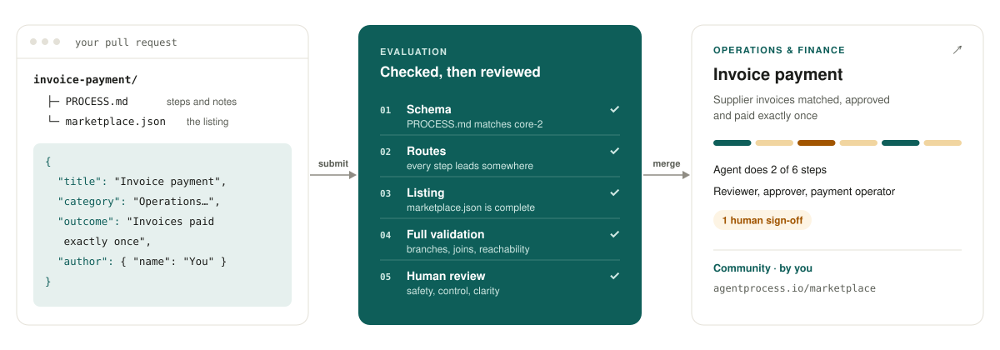
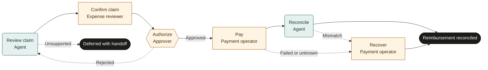

<div align="center">

<a href="https://agentprocess.io/marketplace/">
  <picture>
    <source media="(prefers-color-scheme: dark)" srcset=".github/assets/logo-dark.svg">
    
  </picture>
</a>

### The marketplace of ready-to-adapt processes that AI agents and people run together.

Pick a process for the work you repeat. Your agents do the legwork, your people make the calls,<br>and every step is written in plain language you can change.

[](https://github.com/agentprocess/marketplace/actions/workflows/validate.yml)
[](https://github.com/agentprocess/agentprocess/blob/main/spec/specification.md)
[](LICENSE)
[](#submit-a-process)

[**Browse the marketplace**](https://agentprocess.io/marketplace/) · [**The catalog**](#the-catalog) · [**Submit a process**](#submit-a-process) · [**How we evaluate**](#how-submissions-are-evaluated) · [**Spec**](#the-format)

</div>

<br>

<picture>
  <source media="(prefers-color-scheme: dark)" srcset=".github/assets/hero-dark.svg">
  
</picture>

## What's in a process

Each folder here is one process, in the open [Agent Process](https://github.com/agentprocess/agentprocess) format:

```text
expense-reimbursement/
├── PROCESS.md          the steps: what agents do, what people do and approve, how it ends
└── marketplace.json    how it's listed: title, category, audience, outcome, author
```

A `PROCESS.md` says exactly who does what. This is the expense reimbursement process, simplified:



Every process in this repository includes:

- **Steps with an owner.** Each one is done by an agent, done by a person, or approved by a person.
- **Every way it can end.** That includes the routes for rejection, failure and handing off to someone else, not just the happy path.
- **Before adoption.** What to set up first: people, access, policies and systems.
- **Rehearsal cases.** A normal run, a rework, a failure and an exception to test before going live.

## The catalog

Steps: 🟩 agent · 🟨 person · 🟧 person approves · 🟦 wait · ⬜ in parallel

<!-- catalog:start -->

### Operations and finance

| Process | What you get | Steps |
|---|---|---|
| [**Equipment maintenance**](equipment-maintenance/PROCESS.md)<br><sub>Facilities and equipment owners</sub> | Equipment repaired or serviced and safely back in use | 🟩⁠🟨⁠🟧⁠🟨⁠🟨⁠🟨 |
| [**Expense reimbursement**](expense-reimbursement/PROCESS.md)<br><sub>Employees and finance teams</sub> | Expense claims reviewed, approved, paid and matched in the books | 🟩⁠🟨⁠🟧⁠🟨⁠🟩⁠🟨 |
| [**Inventory replenishment**](inventory-replenishment/PROCESS.md)<br><sub>Stockroom and retail operations</sub> | Low stock spotted, reorders approved and incoming stock tracked | 🟩⁠🟨⁠🟧⁠🟨⁠🟩⁠🟨 |
| [**Invoice payment**](invoice-payment/PROCESS.md)<br><sub>Accounts payable and treasury</sub> | Supplier invoices matched, approved and paid exactly once | 🟩⁠🟨⁠🟧⁠🟨⁠🟩⁠🟨 |
| [**Purchase request**](purchase-request/PROCESS.md)<br><sub>Teams buying goods or services</sub> | Purchases approved by the right person and the order confirmed | 🟩⁠🟩⁠🟧⁠🟨⁠🟩⁠🟨 |
| [**Subscription renewal**](subscription-renewal/PROCESS.md)<br><sub>Software and service owners</sub> | Software and service renewals decided before they auto-renew | 🟩⁠🟨⁠🟨⁠🟩⁠🟨 |
| [**Supplier onboarding**](supplier-onboarding/PROCESS.md)<br><sub>Procurement and vendor administrators</sub> | New suppliers checked, approved and set up correctly in your records | 🟩⁠🟩⁠🟧⁠🟨⁠🟩⁠🟨 |

### Sales, customers and content

| Process | What you get | Steps |
|---|---|---|
| [**Client onboarding**](client-onboarding/PROCESS.md)<br><sub>Agencies and service businesses</sub> | New clients set up, checked against what was agreed, and handed over | 🟩⁠🟩⁠🟧⁠🟨⁠🟨⁠🟨⁠🟩 |
| [**Content publication**](content-publication/PROCESS.md)<br><sub>Marketing and editorial teams</sub> | Content reviewed, approved and checked once it's live | 🟩⁠🟩⁠🟨⁠🟧⁠🟩⁠🟨⁠🟩⁠🟨 |
| [**Customer offboarding**](customer-offboarding/PROCESS.md)<br><sub>Subscription and service businesses</sub> | Customers leave cleanly: access removed, data handled, billing closed | 🟩⁠🟩⁠🟧⁠🟨⁠🟨⁠🟩⁠🟨 |
| [**Customer support resolution**](customer-support-resolution/PROCESS.md)<br><sub>Support teams</sub> | Customer issues fixed and confirmed, or handed to the right specialist | 🟩⁠🟩⁠🟧⁠🟨⁠🟨⁠🟨 |
| [**Lead qualification**](lead-qualification/PROCESS.md)<br><sub>Sales teams</sub> | Every new lead reviewed, followed up or politely closed | 🟩⁠🟩⁠🟨⁠🟩⁠🟨⁠🟩 |
| [**Return and refund**](return-and-refund/PROCESS.md)<br><sub>Commerce teams</sub> | Returns decided fairly, with refunds paid or a clear reason given | 🟩⁠🟨⁠🟨⁠🟧⁠🟨⁠🟨⁠🟨 |

### People and projects

| Process | What you get | Steps |
|---|---|---|
| [**Employee offboarding**](employee-offboarding/PROCESS.md)<br><sub>HR and IT</sub> | Leavers' access removed and company equipment returned | 🟩⁠🟧⁠🟨⁠🟨⁠🟧 |
| [**Employee onboarding**](employee-onboarding/PROCESS.md)<br><sub>HR, IT and hiring managers</sub> | New starters have their laptop, accounts and first week ready on day one | 🟩⁠🟧⁠⬜⁠🟨⁠🟨⁠🟧 |
| [**Event planning**](event-planning/PROCESS.md)<br><sub>Event sponsors and coordinators</sub> | Events planned within budget, with bookings confirmed and ready | 🟩⁠🟧⁠🟨⁠🟩⁠🟧 |
| [**Hiring interview**](hiring-interview/PROCESS.md)<br><sub>Hiring teams</sub> | Interviews organised and a fair, documented hiring decision made | 🟩⁠🟧⁠🟨⁠🟩⁠🟨 |
| [**Meeting action follow-up**](meeting-action-follow-up/PROCESS.md)<br><sub>Team leads</sub> | Meeting actions followed up until they're done or clearly owned | 🟩⁠🟧⁠🟩⁠🟨⁠🟧⁠🟩 |
| [**Project kickoff**](project-kickoff/PROCESS.md)<br><sub>Project owners and delivery teams</sub> | Projects start with agreed scope, owners and a ready workspace | 🟩⁠🟧⁠🟨⁠🟨⁠🟧 |

### Personal life

| Process | What you get | Steps |
|---|---|---|
| [**Job application**](job-application/PROCESS.md)<br><sub>Job seekers</sub> | A truthful, reviewed job application submitted and followed up | 🟩⁠🟨⁠🟩⁠🟧⁠🟨 |
| [**Learning goal**](learning-goal/PROCESS.md)<br><sub>Self-directed learners</sub> | A learning goal turned into practice and something you can show | 🟩⁠🟧⁠🟨⁠🟩⁠🟨 |
| [**Moving home**](moving-home/PROCESS.md)<br><sub>Households</sub> | Your move packed, addresses updated and handover done | 🟩⁠🟨⁠⬜⁠🟨⁠🟨⁠🟨 |
| [**Personal document renewal**](personal-document-renewal/PROCESS.md)<br><sub>Document holders</sub> | Passports, licences and permits renewed before they expire | 🟩⁠🟨⁠🟨⁠🟨⁠🟨 |
| [**Travel planning**](travel-planning/PROCESS.md)<br><sub>Individuals and families</sub> | Your trip booked, confirmed and ready to go | 🟩⁠🟨⁠🟨⁠🟨 |
| [**Weekly planning**](weekly-planning/PROCESS.md)<br><sub>Individuals and freelancers</sub> | A realistic plan for your week, saved in your calendar | 🟩⁠🟨⁠🟨 |

<!-- catalog:end -->

## Use a process

1. **Pick one.** Browse the [marketplace](https://agentprocess.io/marketplace/) to see each process's map, scenarios and setup checklist, or open its folder here.
2. **Adapt it.** Name your people, tools and rules. On the marketplace, **Copy prompt for your AI assistant** gives ChatGPT, Claude or Copilot everything it needs to walk you through it.
3. **Rehearse it.** Run the rehearsal cases with test data before anything touches real accounts.
4. **Run it.** Publish it to any server that supports Agent Process. Agents that speak MCP work the agent steps; people get the tasks and approvals.

These are templates, not anyone's real procedures. Passing our checks means a file is well formed and reviewed, not that it fits your business. Review the policies, people and access it assumes.

## Submit a process

Have a process that works for your team? Share it. Every accepted process is listed on the marketplace with your name on it.

**1. Write it.** Create a folder named after the process, in lowercase words joined by hyphens, such as `vendor-renewal/`. Add a `PROCESS.md` ([quickstart](https://agentprocess.io/docs/authoring/quickstart/)). Its `name` must match the folder name. Sketch it in the [playground](https://agentprocess.io/playground/) to see the map as you type. The processes in this repository are good models.

**2. Describe it.** Add a `marketplace.json`:

```json
{
  "title": "Vendor renewal",
  "category": "Operations and finance",
  "audience": "Finance and procurement teams",
  "outcome": "Vendor contracts renewed or cancelled before they auto-renew",
  "keywords": ["contract", "renewal", "vendor", "procurement"],
  "author": { "name": "Your name or company", "url": "https://example.com" }
}
```

**3. Check it.** Run the same check as CI:

```bash
npm install --no-save ajv@8 yaml@2
node .github/validate.mjs
```

**4. Open a pull request** with only your folder. Fill in the checklist in the template. A maintainer reviews it and may suggest changes.

**To update or remove** a process you contributed, open a pull request that changes or deletes its folder.

## How submissions are evaluated

Every pull request goes through two stages. Both must pass before anything is merged.

### 1. Automatic checks

These run on every pull request ([`validate.mjs`](.github/validate.mjs)) and list everything to fix at once.

| Check | What it catches |
|---|---|
| **Schema** | `PROCESS.md` frontmatter that doesn't match the [core-2 JSON Schema](https://github.com/agentprocess/agentprocess/blob/main/schemas/core-2/process-document.json): unknown keys, wrong types, bad step ids. |
| **Name** | A `name` that differs from the folder name. |
| **Routes** | A `next`, `on_reject`, `on_timeout` or `parallel` that points at a step that doesn't exist; duplicate step ids; no `finish` step. |
| **Listing** | A `marketplace.json` with missing fields, an unknown category or extra fields. |
| **Full validation** | Before listing, the marketplace runs the reference validator: reachable steps, parallel branches and joins, and profile rules. |

### 2. Human review

A maintainer reads every process as an adopter would and checks it against these criteria:

| Criterion | What we look for |
|---|---|
| **Safety** | No hidden data transfers, no requests for passwords or secrets, nothing that tries to override an agent's other instructions. |
| **People in control** | A person approves anything that can't be undone: payments, deletions, contracts, messages to customers. |
| **Clear outcome** | It names a result a business cares about, and every way a run can end. |
| **Recovery** | Failures, timeouts and unknown results have a route, and nothing retries blindly. |
| **General** | No real people, companies, customer data, credentials or internal links. Roles, not names. |
| **Ready to adopt** | **Before adoption** and **Rehearsal cases** sections a newcomer can follow. |
| **Original** | You wrote it or may share it, and it doesn't duplicate a listed process. Improvements to an existing one are welcome as a pull request on that folder. |

Processes by Agent Process are marked as ours on the marketplace. Contributed processes are labeled **Community** with the author's name.

## The format

A process is the [Agent Process specification](https://github.com/agentprocess/agentprocess/blob/main/spec/specification.md)'s `PROCESS.md`: YAML frontmatter with the steps, then plain-language notes. Processes here use the core format and the [`parallel`](https://github.com/agentprocess/agentprocess/blob/main/spec/profiles/parallel.md) profile.

| Step kind | Who | What happens |
|---|---|---|
| `agent` | An AI agent | Does the work and submits the declared output and evidence. |
| `task` | A person | Does the work and records the result. |
| `approve` | A person | Approves, or rejects with a note; `on_reject` says where the run goes back to. |
| `wait`, `wait_until`, `wait_for` | Nobody | Waits for a time or an event, with an optional timeout route. |
| `parallel` | Several | Starts branches that all finish before the run continues. |
| `finish` | — | Ends the run with a named outcome. |

`marketplace.json` fields:

| Field | Required | Rules |
|---|:-:|---|
| `title` | ✓ | The process name as people say it. |
| `category` | ✓ | One of `Operations and finance`, `Sales, customers and content`, `People and projects`, `Personal life`. |
| `audience` | ✓ | Who it's for, such as "Support teams". |
| `outcome` | ✓ | One plain sentence about the result. |
| `keywords` | ✓ | Phrases people might search for. Can be empty. |
| `author.name` | ✓ | You or your company. |
| `author.url` | | A link starting with `https://`. |

Learn more: [quickstart](https://agentprocess.io/docs/authoring/quickstart/) · [best practices](https://agentprocess.io/docs/authoring/best-practices/) · [how decisions are made](https://agentprocess.io/docs/authoring/decisions/) · [process maps](https://agentprocess.io/docs/authoring/process-maps/)

## FAQ

<details>
<summary><b>Can I use these processes in my business?</b></summary>
<br>
Yes, including commercially, under the <a href="LICENSE">Apache-2.0 license</a>. Adapt them as much as you like.
</details>

<details>
<summary><b>Do I need Agent Process to use them?</b></summary>
<br>
No. A process runs on any server that implements the open Agent Process protocol, and people can read and follow one as a written procedure too.
</details>

<details>
<summary><b>Will my agent follow a process on its own?</b></summary>
<br>
An agent does the agent steps it's given. The server decides which step is next, makes sure people do the approvals, and checks what the agent hands back. A process never gives an agent access it doesn't already have.
</details>

<details>
<summary><b>Who decides what gets listed?</b></summary>
<br>
The maintainers of this repository, using the criteria above. We may decline a process that's safe but too narrow, or ask to merge it with a similar one.
</details>

<details>
<summary><b>I found a problem in a process.</b></summary>
<br>
<a href="https://github.com/agentprocess/marketplace/issues/new">Open an issue</a>, or a pull request with the fix. Report anything unsafe as an issue and we'll act on it first.
</details>

## License

[Apache-2.0](LICENSE). By opening a pull request, you agree your contribution is licensed the same way.
