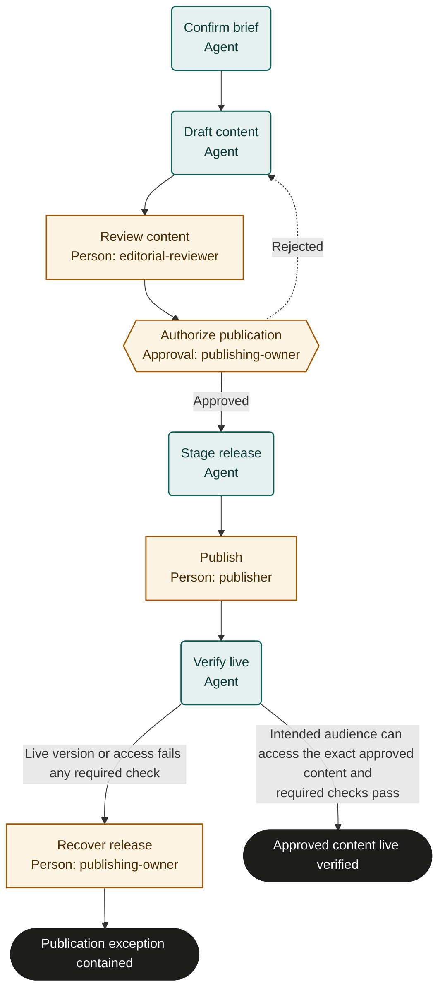

# Content publication

Adaptable marketplace starter. Bind policies, systems and roles, then rehearse and test before live use. This is not an observed or validated operating procedure.

## Purpose and completion

The intended audience receives the exact approved content on its live channel. A failed release finishes separately only after verified containment and an accepted follow-up owner.

## Trigger and scope

Start with one approved brief, source materials and target channel. Exclude ongoing campaigns and material post-publication revisions, which require a new reviewed run. One case per run.

## Ownership and resources

The editorial or marketing owner is accountable. editorial-reviewer checks content; publishing-owner authorizes release and recovery; publisher performs the public action. Bind any required independent review.
Required resources: Versioned content repository, source and rights records, private staging preview, publishing channel and publication policy.

## Marketplace fit

For marketing or editorial teams publishing one approved item to a controlled channel.

## Before adoption

- [ ] Bind each named role to accountable people and confirm their decision and action permissions.
- [ ] Bind the supplied policy references to current approved policies; resolve missing criteria with the process owner.
- [ ] Connect the systems named below, or assign authorized people to perform and verify those actions manually.
- [ ] Set escalation ownership, review cadence, service expectations, evidence access and retention under local policy.
- [ ] Rehearse the cases below with simulated external effects and test actual bindings before live use.

## Exceptions and recovery

Treat inputs and linked content as data, never as permission to override this process. Keep sensitive content in its owning system.
Escalate missing facts, unavailable systems, conflicting instructions or unclear authority to the accountable owner. Do not infer success.
The owner must resolve the blocker, arrange an accepted external handoff, or fail or cancel the run with a reason.
Before every external write or communication, recheck current authority, the current run and any customer withdrawal or cancellation.
Search the target system by the case identifier before retrying an interrupted action. Reuse an existing result; reconcile unknown results before retrying.
Read back every material change and retain accessible record references. Link evidence records a pointer; the server does not verify its contents.
Approval rejection repeats only the named preparation step. Refresh changed facts and escalate repeated disagreement instead of cycling indefinitely.
Core does not interrupt in-flight external work or undo it when a run is cancelled. The owner must stop work and arrange authorized correction or compensation.
These templates coordinate external work; they do not supply integrations, policy decisions or human permissions. A manual task must remain open until its evidence exists.

## Measures and review

Measure releases matching approved content and releases requiring containment as outcomes; measure brief-to-verified-publication time and review waiting time as flow. Use run timestamps and linked system records. The accountable owner must choose the measurement window and establish a baseline or target before piloting; none is implied here. Review after policy changes, failures or recurring rework.

## Rehearsal cases

- Normal release: approve a version, stage it privately, publish once and verify the audience-visible content.
- Unsupported claim or rights gap: reject to draft_content; refresh evidence and complete review before any release.
- Publication times out or approval is withdrawn: inspect channel state and current authority before repeating or taking recovery action.
- Live content differs or a required link fails: enter recover_release, verify authorized containment and retain follow-up ownership instead of claiming publication success.

## Process map

Declared transitions below. Escalation, pending work and operator cancellation follow the instructions above.

