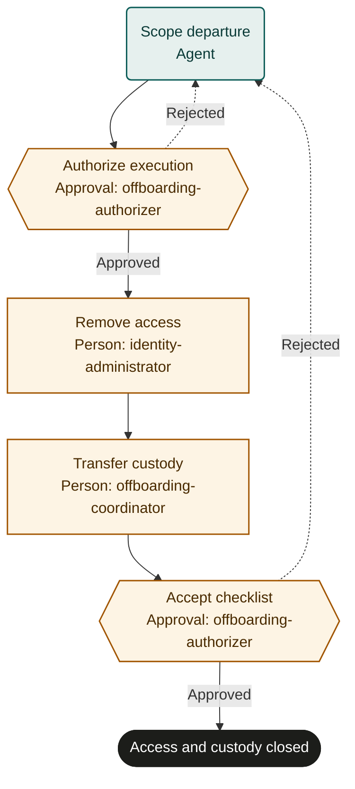

# Employee offboarding

An adaptable starter template. Configure policies, role bindings and a supervised pilot before live use.

## Purpose and completion
Give the accountable departure authorizer evidence of access removal and custody reconciliation.
`access_and_custody_closed` requires verified in-scope revocation, preserved records and reconciled assets.
Assets may remain under an explicitly accepted recovery arrangement; completion does not mean every asset was physically returned.

## Start and scope
Start from an authorized departure record with an effective time and identified employee.
Cover access, session revocation, preservation, data custody and equipment reconciliation.
Exclude the employment decision, payroll settlement and legal interpretation.
This sequential template is unsuitable for emergency simultaneous revocation unless adapted and tested for that requirement.

## Ownership and resources
The people-operations owner coordinates the checklist. The offboarding authorizer holds the organization's departure authority.
Identity administrators perform security changes. The coordinator manages authorized custody and asset records.

Marketplace fit: Teams needing a traceable departure checklist across HR, identity and equipment systems.

## Before adoption
- Bind authorizer, identity administrator and coordinator to people with appropriate authority.
- Supply authoritative HR, identity, asset and data-custody systems and supported read-back methods.
- Confirm departure timing, preservation, privacy, session revocation and asset-exception policies.
- Define urgent-response routing and the system inventory needed to avoid omitted access.
- Set follow-up ownership, service expectations and a supervised pilot with simulated revocations.

## Exceptions and recovery
Before each external write, booking or message, recheck the current run, source request and authority. Stop and involve the owner if the request was withdrawn, the run ended or permission changed. A read-before-action check does not provide an atomic cancellation interlock; use the source system’s controls for consequential actions.
Missing authorization blocks execution. The authorizer resolves timing and scope conflicts.
For unknown action results, inspect current system state by employeeRecordRef and offboardingId before retrying.
Record partial revocations and have administrators finish remaining systems; do not re-enable access during ordinary rework.
If an incorrect revocation needs restoration, require fresh authorization through the organization's security procedure.
Use a reference stating that no asset exceptions exist when exceptionRef has no applicable exception record.
Repeated rejection or unavailable critical systems requires operator intervention and the adopted incident procedure.
Cancellation does not reverse revocations or preservation actions.

## Measures and review
Measure departures with verified removal of all inventoried access using revocation records and reviewer decisions.
Measure elapsed time between effectiveAt and verifiedAt, including early or late execution deviations.
The owner sets measurement windows and targets and reviews inventory gaps after each pilot and material system change.

## Rehearsal cases
- Normal departure: all access is revoked; custody and assets reconcile before acceptance.
- Conflicting effective times: scope preparation escalates before any account changes.
- Revocation response is lost: read back account and session state before repeating an action.
- Device remains outstanding: authorizer accepts an owned recovery arrangement or rejects closure; access stays revoked.

## Process map

Declared transitions below. Escalation, pending work and operator cancellation follow the instructions above.

