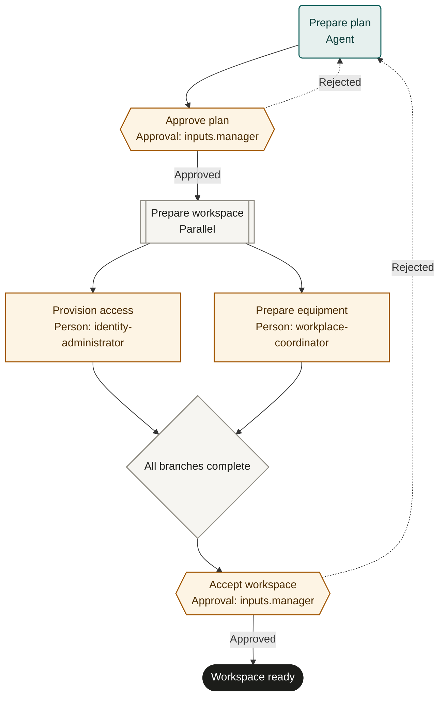

# Employee onboarding

An adaptable starter template. Configure it and run a supervised pilot before live use.

## Purpose and completion
Give the employee and manager a verified workspace preparation record and first-week plan.
`workspace_ready` means the manager accepted access, equipment arrangements and the plan.
It does not establish completed employment paperwork, delivered training or employee attendance.

## Start and scope
Start after employment approval and an authoritative employee record exist.
Use one onboardingId per employee start. Exclude offer negotiation, payroll enrollment and sensitive document collection.
Hand unresolved employment prerequisites to HR before starting this workflow.

## Ownership and resources
The people-operations owner maintains this process. The manager approves role requirements and accepts readiness.
Identity administrators control account changes; workplace coordinators control asset allocations.
The two preparation branches are independent after approval. Both must finish before acceptance.

Marketplace fit: Small and growing teams coordinating HR, IT and workplace preparation across existing systems.

## Before adoption
- Bind all roles to authorized people and confirm parallel-1 support.
- Choose authoritative HR, identity, asset and checklist systems with reviewer-readable evidence links.
- Supply access, employment approval, equipment, privacy and timing policies; define exception authority.
- Grant least-privilege access and agree which changes need additional local approvals.
- Set service expectations, pilot cases and the manager's acceptance criteria.

## Exceptions and recovery
Before each external write, booking or message, recheck the current run, source request and authority. Stop and involve the owner if the request was withdrawn, the run ended or permission changed. A read-before-action check does not provide an atomic cancellation interlock; use the source system’s controls for consequential actions.
Escalate missing records or conflicting start dates to the people-operations owner.
Use onboardingId plus employee record to reconcile each external action before retrying.
If an account or allocation exists, update or reuse it; never create a duplicate to clear a failed attempt.
Remove incorrect access through an authorized administrator and record the correction.
A rejection refreshes affected records and approvals; repeated rejection goes to the owner for operator intervention.
An operator handles cancellation, including external account or asset cleanup; a run cancellation does not undo changes.

## Measures and review
Track manager-accepted readiness without rework from approval history and preparation records.
Track start-to-acceptance elapsed time and branch waiting time from run timestamps.
The owner sets the measurement window, baseline and targets before piloting; review after policy or system changes.

## Rehearsal cases
- Normal start: both preparation branches complete; the manager accepts workspace readiness.
- Excessive entitlement: manager rejects the plan; corrected access receives fresh approval.
- Account write response is lost: reconcile the employee account, then record read-back without duplication.
- Equipment is unavailable: escalate an alternative; prevent acceptance while the start arrangement remains blocked.

## Process map

Declared transitions below. Escalation, pending work and operator cancellation follow the instructions above.

