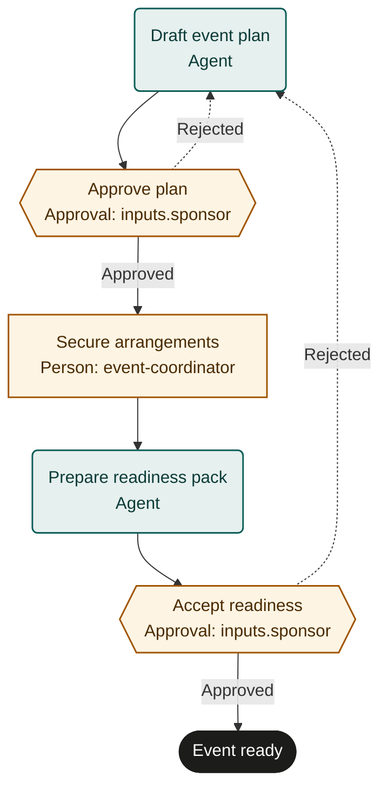

# Event planning

An adaptable starter template. Configure event-specific policy and run a supervised pilot before live use.

## Purpose and completion
Give the event sponsor and coordinator an approved readiness pack backed by confirmed arrangements.
`event_ready` means the sponsor accepted readiness for the planned event.
It does not mean invitations were sent, the event took place or post-event reconciliation finished.

## Start and scope
Start from an authorized event brief with an eventId, sponsor and proposed event date.
Cover planning, approved bookings, staffing and readiness acceptance.
Exclude event delivery, attendee registration operations, participant message sending and post-event accounting.
Use separate authorized procurement or contract processes where policy requires them.

## Ownership and resources
The events owner maintains this workflow. The sponsor approves scope, spending authority and readiness.
The event coordinator handles permitted bookings and delivery handoff; purchasing authorities retain contract approval rights.

Marketplace fit: Operations teams planning internal, community or customer events using their existing booking and procurement systems.

## Before adoption
- Bind sponsor, coordinator and required purchasing authorities to authorized people.
- Supply event, spending, contract, cancellation, accessibility, privacy and safety requirements applicable to the event.
- Choose authoritative booking, procurement, staffing and document systems with readable confirmation records.
- Grant booking permissions and define approval limits, accepted dependencies and contingency decision authority.
- Agree planning service expectations, readiness criteria and a supervised pilot with simulated purchases.

## Exceptions and recovery
Before each external write, booking or message, recheck the current run, source request and authority. Stop and involve the owner if the request was withdrawn, the run ended or permission changed. A read-before-action check does not provide an atomic cancellation interlock; use the source system’s controls for consequential actions.
Escalate uncertain policy, unavailable venues or changed commercial terms to the sponsor before committing.
Reconcile external actions by eventId and confirmation ID before retrying; read back the supplier or platform record.
On rejection, reuse confirmed bookings and update only authorized changes. Check cancellation costs before modifying commitments.
The coordinator requests authorized cancellation or compensation for mistaken bookings and records the outcome.
Cancellation of a run does not cancel supplier commitments; an operator must assign that cleanup explicitly.
Repeated rejection or a delivery blocker near the event date requires a sponsor decision under the adopted contingency procedure.

## Measures and review
Measure accepted readiness packs without unresolved delivery blockers from acceptance and booking records.
Measure brief-to-readiness elapsed time and time waiting on supplier confirmations from run and booking timestamps.
The events owner sets measurement windows and targets; review after pilots, cancellations and material policy changes.

## Rehearsal cases
- Normal event: bookings, staffing and contingency instructions support sponsor acceptance of event_ready.
- Venue cost exceeds approved authority: coordinator escalates and obtains separate approval before committing.
- Booking response is lost: reconcile eventId with the supplier and record confirmation without purchasing twice.
- Readiness review finds inaccessible arrangements: reject, revise the plan and refresh affected bookings and approval.

## Process map

Declared transitions below. Escalation, pending work and operator cancellation follow the instructions above.

