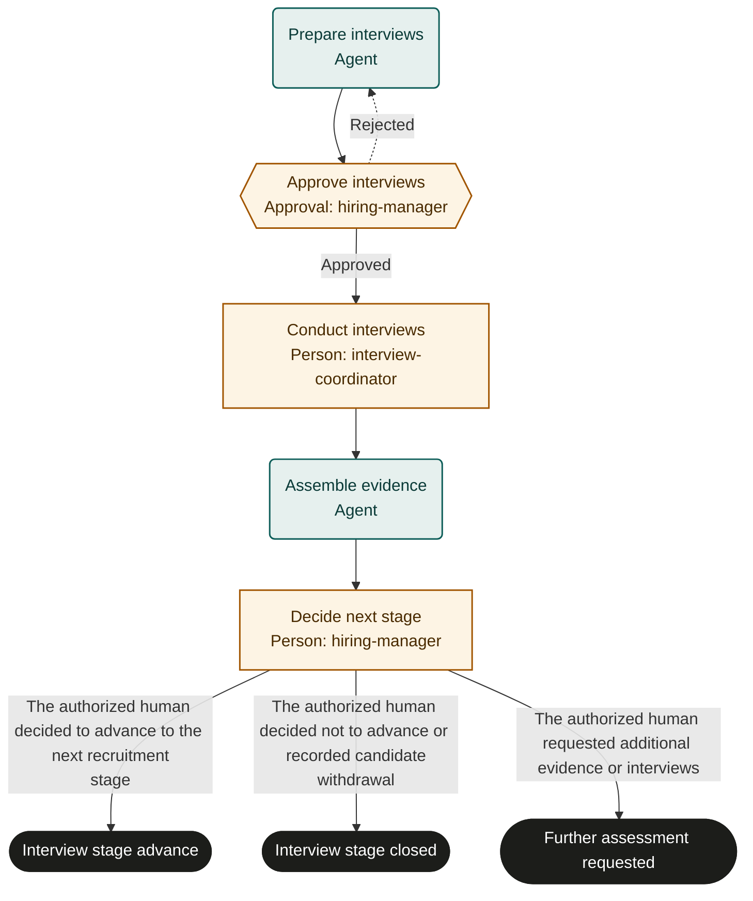

# Hiring interview

An adaptable starter template. Configure it with recruitment practitioners and pilot before live use.

## Purpose and completion
Give the hiring manager a source-linked interview record and a recorded human next-stage decision.
The outcomes mean advance, close the interview stage, or request more assessment.
None means a person was hired, an offer was approved or a rejection notification was sent.

## Start and scope
Start with an approved role and a candidate authorized to enter the interview stage.
Cover interview planning, scheduling, observations and a human decision for one candidate.
Exclude automated candidate ranking or rejection, background checks, compensation and offer approval.
Hand further assessment to the recruiting coordinator for an authorized follow-up run with the original case reference.

## Ownership and resources
The recruitment owner maintains the procedure. The hiring manager approves criteria and owns the next-stage decision.
The coordinator schedules interviews and gathers records; panel members supply observations through the recruiting system.
Agents organize factual material and never make employment decisions.

Marketplace fit: Recruiting teams that want consistent interview evidence while keeping candidate decisions with people.

## Before adoption
- Bind hiring manager and coordinator roles and confirm panel responsibilities.
- Supply approved job criteria, interview, accessibility, retention and candidate-contact policies.
- Choose a restricted recruiting system, scheduling system and reviewer-readable evidence references.
- Limit run data to references; confirm participant access and permission for invitations and decision writes.
- Define follow-up ownership, service expectations and representative supervised pilot cases.

## Exceptions and recovery
Before each external write, booking or message, recheck the current run, source request and authority. Stop and involve the owner if the request was withdrawn, the run ended or permission changed. A read-before-action check does not provide an atomic cancellation interlock; use the source system’s controls for consequential actions.
Escalate missing criteria or inappropriate notes to the recruitment owner before assessment continues.
The manager may reject the interview plan for correction; repeated rejection requires owner intervention.
Interrupted invitations or decision writes require lookup by interviewCaseId and read-back before retrying.
Correct existing invitations rather than creating duplicates. Confirm changed schedules with affected recipients under local policy.
Missing interview evidence leads to the human further-assessment outcome unless an authorized exception supports advancement.
Candidate communications after the decision require the organization's separate approved communication procedure.

## Measures and review
Measure decisions supported by accessible job-related evidence using manager review and recruiting records.
Measure interview-stage elapsed time and time awaiting interviewer notes from run and recruiting timestamps.
The recruitment owner chooses measurement windows and targets; review pilot gaps and policy changes.

## Rehearsal cases
- Completed interviews: the human compares role criteria and records an advance decision.
- Candidate withdraws: record withdrawal and human closure without fabricated interview evidence.
- Missing interviewer notes: record gaps and request further assessment rather than inventing a score.
- Invitation response is lost: locate the existing calendar event and read back recipients before retrying.

## Process map

Declared transitions below. Escalation, pending work and operator cancellation follow the instructions above.

