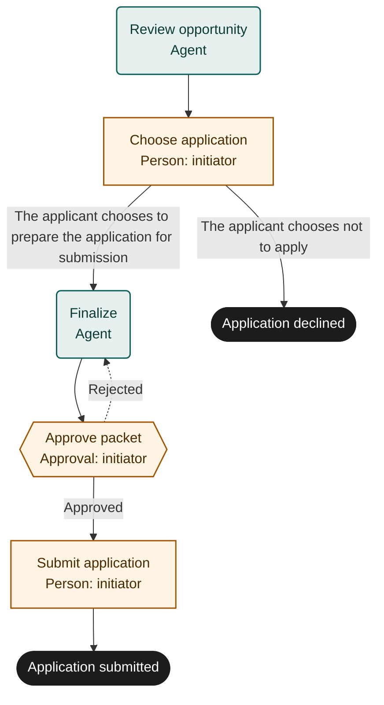

# Job application

Marketplace fit: Job seekers who want tailored, truthful applications with a final personal review.

## Purpose and scope
The initiating applicant owns one application to one posting. Completion means submission is confirmed and follow-up is recorded; it does not imply an interview or offer. Employer selection decisions and automated candidate ranking are outside scope.

## Before adoption
- Start as a person and supply the real posting, documented experience and preferences.
- Choose secure document storage and decide what personal information may be shared with the agent.
- Confirm the employer's legitimate submission channel and required formats; no email or portal permission is implied by this template.
- Rehearse using a fictional posting and applicant. No applications or messages should be sent during a test run.

## Exceptions and recovery
A closed posting or suspect channel prevents submission. The applicant resolves factual questions; the agent cannot fill experience gaps with invented claims. After a lost submission response, inspect application history or contact the employer through a verified channel before trying again. A recorded follow-up plan is not an automatically scheduled message.

## Measures and review
Track submitted applications with verified receipt and corrections found at final review. Measure time from posting review to confirmed submission. Review process friction independently from employer outcomes.

## Rehearsal cases
- Applicant decides not to apply: application_declined before submission.
- A draft overstates experience: applicant corrects it before approval.
- Packet is rejected: revised files return for a fresh review.
- A portal times out after accepting: recover the existing confirmation without duplicate submission.

## Process map

Declared transitions below. Escalation, pending work and operator cancellation follow the instructions above.

