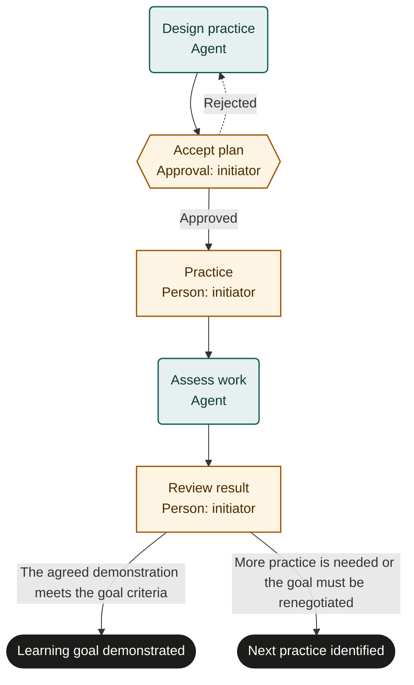

# Learning goal

Marketplace fit: Self-directed learners developing a concrete skill through practice and feedback.

## Purpose and scope
The initiating learner owns a single bounded goal, such as building a small project or delivering a presentation. Success is demonstrated performance against the learner's agreed criteria. This is not professional certification or an assessment for hiring or admission.

## Before adoption
- Start as a person. Supply a baseline, realistic available time and observable criteria.
- Confirm access and permission to share work with the feedback agent. Select resources before buying anything.
- For goals requiring expert assessment, bind an appropriate reviewer in a customized copy rather than relying on model judgment.
- Rehearse with a short sample task before adopting a long learning plan.

## Exceptions and recovery
Reject an unsuitable plan before practice begins. Record interrupted or partial practice honestly. Missing evidence prevents assessment. If the demonstration falls short, this run records the next practice goal; start another run intentionally rather than inventing an unsupported task loop.

## Measures and review
Track criteria demonstrated without assistance and time from accepted plan to reviewed work. Compare estimates with actual effort and adjust the next plan without rewriting this run's success criteria.

## Rehearsal cases
- Plan rejected as too large: revise and approve a smaller plan.
- Work is inaccessible: assessment escalates and does not invent feedback.
- Criteria are met: evidence supports learning_goal_demonstrated.
- Criteria are not met: next_practice_identified records the next action.

## Process map

Declared transitions below. Escalation, pending work and operator cancellation follow the instructions above.

