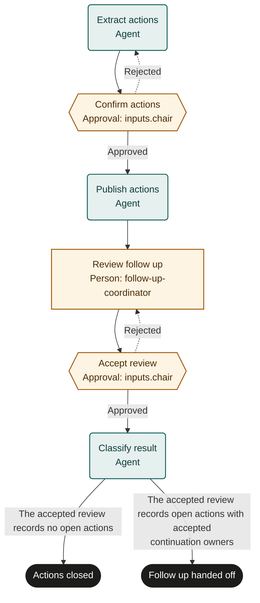

# Meeting action follow-up

An adaptable starter template. Set up systems, notification authority and a supervised pilot before live use.

## Purpose and completion
Give the meeting chair an accurate action register and an accepted follow-up review.
`actions_closed` requires evidence that all actions are complete, or approval that the meeting created no actions.
`follow_up_handed_off` means open work has an accepted owner and follow-up arrangement; it does not mean that work is complete.

## Start and scope
Start after a meeting with an authoritative record and an identified chair.
Cover action extraction, owner confirmation, task publication and one follow-up cycle.
Exclude performing the underlying work and indefinite reminder automation.
The coordinator hands open work to its existing tracker or a separately authorized follow-up run.

## Ownership and resources
The meeting-operations owner maintains this process. The chair approves commitments and accepts the review.
The follow-up coordinator obtains updates; action owners accept and perform their work outside this process.

Marketplace fit: Teams whose meeting commitments need clear ownership and traceable follow-up in an existing task system.

## Before adoption
- Bind chair and follow-up coordinator roles and establish how action owners confirm commitments.
- Supply authoritative meeting, task and communication systems with stable action identifiers.
- Define notification permissions, acceptable evidence, date changes and the follow-up review cadence.
- Limit transcript and task visibility to authorized participants; confirm authorized agent write access.
- Agree service expectations and pilot normal, empty and blocked action registers.

## Exceptions and recovery
Before each external write, booking or message, recheck the current run, source request and authority. Stop and involve the owner if the request was withdrawn, the run ended or permission changed. A read-before-action check does not provide an atomic cancellation interlock; use the source system’s controls for consequential actions.
Escalate ambiguous commitments to the chair; keep unsupported actions in the draft until resolved.
Before retrying writes or messages, reconcile meetingId and action ID with target records and delivery status.
Correct existing tasks and reuse references. Do not duplicate reminders after an unknown delivery result.
A rejected review returns to review_follow_up; publication corrections require authorized edits with fresh read-back.
The coordinator escalates missing owner responses according to adopted policy and never fabricates completion.
Repeated rejection or disputed authority goes to the process owner for operator intervention.

## Measures and review
Measure accepted reviews with evidenced closure or owned continuation from action records and chair decisions.
Measure meeting-to-approved-register time and follow-up review waiting time from run and tracker timestamps.
The owner sets measurement windows and targets and reviews recurring ambiguity or overdue-owner patterns.

## Rehearsal cases
- All tasks have completion evidence: chair accepts review and the run ends actions_closed.
- Meeting has no actions: chair confirms the empty register; no task or notification is created.
- An action remains blocked: obtain an accepted continuation owner and end follow_up_handed_off.
- Task write response is lost: locate meetingId plus action ID and verify fields before retrying.

## Process map

Declared transitions below. Escalation, pending work and operator cancellation follow the instructions above.

