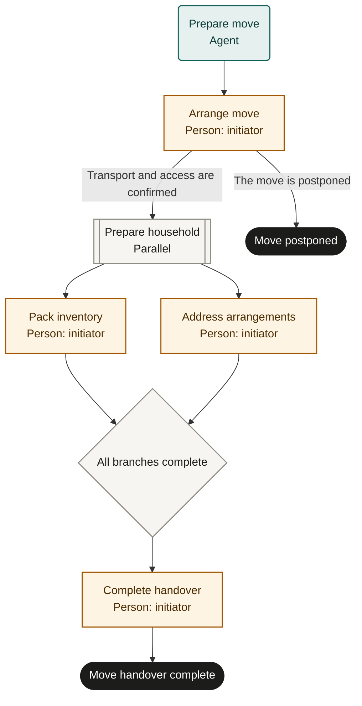

# Moving home

Marketplace fit: Households coordinating transport, packing and utility changes across a single move.

## Purpose and scope
The initiator owns the move. Start after choosing the intended date and defining locations in a private reference. Completion means the agreed physical move and critical handovers are verified, with remaining minor issues assigned. Property purchase, tenancy negotiations and legal advice are outside scope.

## Before adoption
- Start as a person and use a server supporting parallel-1. The same person may complete both preparation branches at different times.
- Define the inventory, access rights, budget, critical handover criteria and any helper/provider responsibilities.
- Keep full addresses, identification and payment details in private source systems.
- Confirm provider availability and terms for the real move. Rehearse this template before bookings or address changes.

## Exceptions and recovery
Postponement does not refund or cancel existing bookings: the initiator reconciles them with providers. Changes during preparation require coordinated updates to both branches and the move plan. Core cancellation stops the run, not a moving vehicle or utility order. Inspect booking and service records before repeating an uncertain action.

## Measures and review
Track critical handovers completed on the agreed date and unresolved inventory issues. Track elapsed time from arrangements to completion. Review damage or missed dependencies before reusing the checklist.

## Rehearsal cases
- Transport and access confirmed: both branches join before handover.
- Transport unavailable: postponed outcome; reconcile any existing bookings.
- Utility request response lost: inspect provider state instead of requesting twice.
- An essential item is missing: keep handover open and resolve it before completion.

## Process map

Declared transitions below. Escalation, pending work and operator cancellation follow the instructions above.

