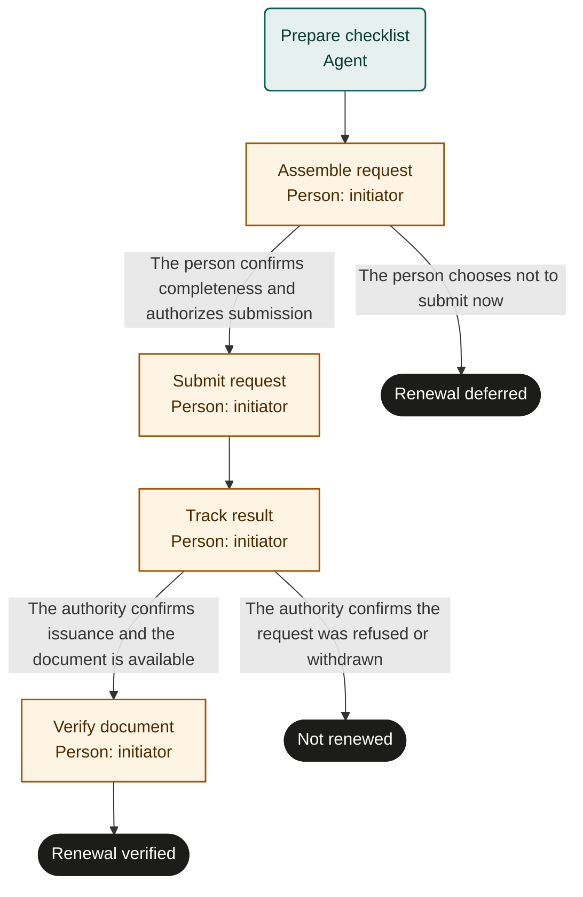

# Personal document renewal

Marketplace fit: People managing a passport, permit, membership credential or other document with an issuing authority.

## Purpose and scope
The document holder owns the run. Start before the holder's chosen deadline with the document type and issuing authority known. Completion means the issued result has been received and checked. This template supplies coordination, not eligibility advice or jurisdiction-specific rules; appeals are outside scope.

## Before adoption
- Start as a person and select one document and authority per run.
- Supply current official instructions through an authoritative reference; confirm fees, eligibility and timelines there.
- Choose secure storage for personal documents, receipts and authentication credentials. Run participants must not receive full identity documents unnecessarily.
- Rehearse with fictional data. Define who follows up if the holder cannot act.

## Exceptions and recovery
The follow-up date is recorded for the person; the template does not install a reminder service or automatically poll the authority. Arrange reminders in your own system. Pending requests remain open; lost responses require reconciliation before repeat submission. A missed deadline is a risk to discuss with the authority, not permission to bypass requirements. Cancellation of a run does not withdraw an official request.

## Measures and review
Track renewal completion against the holder's deadline and requests returned for missing material. Measure elapsed time from confirmed submission to verified result. Refresh the checklist from official instructions on each use.

## Rehearsal cases
- Complete packet is accepted, issued and verified.
- Required evidence is unavailable: the person resolves it or defers.
- Submission response is lost: receipt lookup prevents a duplicate request.
- An issued document has an error: verification remains open.

## Process map

Declared transitions below. Escalation, pending work and operator cancellation follow the instructions above.

