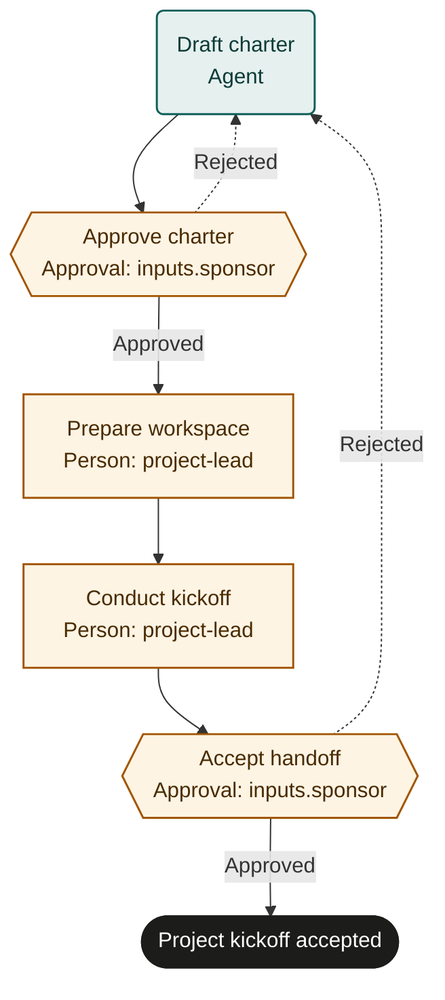

# Project kickoff

An adaptable starter template. Configure organizational policies and run a supervised pilot before live use.

## Purpose and completion
Give the sponsor and project lead an accepted charter, working project space and recorded kickoff agreements.
`project_kickoff_accepted` means the sponsor accepted that handoff. It does not mean delivery has started or finished.

## Start and scope
Start with a sponsored request for a project and a stable projectId.
Cover charter agreement, workspace preparation and kickoff decisions.
Exclude procurement, staffing contracts and execution of project deliverables; route those through their approved processes.

## Ownership and resources
The project-management owner maintains the process. The sponsor authorizes scope and accepts kickoff readiness.
The project lead manages workspace setup, participant commitments and the delivery handoff.

Marketplace fit: Cross-functional teams turning an approved initiative into a shared scope and accountable work plan.

## Before adoption
- Bind sponsor and project-lead roles with documented scope and resource authority.
- Supply charter, approval, collaboration-access and change-control policies.
- Choose authoritative document, project-tracker and calendar systems with readable evidence links.
- Grant permissions for workspace setup and invitations; agree accepted resource and milestone units.
- Set service expectations and pilot acceptance criteria with the intended delivery team.

## Exceptions and recovery
Before each external write, booking or message, recheck the current run, source request and authority. Stop and involve the owner if the request was withdrawn, the run ended or permission changed. A read-before-action check does not provide an atomic cancellation interlock; use the source system’s controls for consequential actions.
Escalate missing sponsorship, conflicting commitments or unavailable systems to the project-management owner.
Search by projectId before repeating workspace, task or invitation writes; read back actual target state.
Reuse existing records after rejection and refresh changed memberships, milestones and participant commitments.
Remove incorrect access through authorized administrators. Record any approved compensation for unintended external changes.
Repeated rejection goes to the owner for an operator decision; do not loop indefinitely.
If the project is withdrawn, an operator cancels the run and arranges separate workspace cleanup.

## Measures and review
Measure kickoff handoffs accepted without unresolved blocking ownership or scope gaps from approval and decision records.
Measure request-to-kickoff acceptance time and approval waiting time from run timestamps.
The owner agrees measurement windows, baselines and targets before piloting and reviews material policy changes.

## Rehearsal cases
- Normal project: approved charter, verified workspace and owner commitments lead to acceptance.
- Budget is only a proposal: sponsor rejects the charter until authority and assumptions are explicit.
- Workspace creation response is lost: find projectId and reuse the workspace after access read-back.
- Kickoff changes scope: reject handoff, revise the charter and refresh affected commitments before acceptance.

## Process map

Declared transitions below. Escalation, pending work and operator cancellation follow the instructions above.

