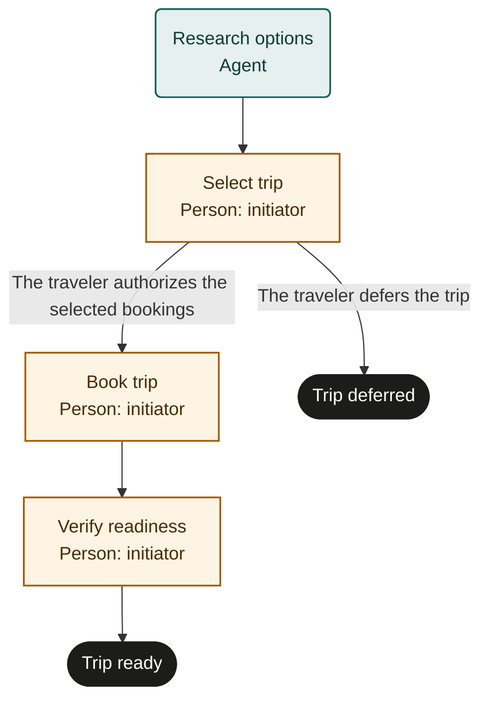

# Travel planning

Marketplace fit: Individuals and families who want a coordinated trip with checked reservations and fewer last-minute surprises.

## Purpose and scope
The initiating traveler owns the plan. Start with intended dates, destination, needs and budget. Trip-ready means the chosen reservations and applicable readiness requirements have been verified; it does not guarantee entry, provider performance or a completed trip. Ongoing disruption monitoring is outside this run.

## Before adoption
- Start as a person; supply private trip and traveler references, budget and booking preferences.
- Ensure the research agent can access current official and provider information. No live prices or rules are bundled in this template.
- The person handles bookings and sensitive documents. Identify any additional traveler consent needed.
- Rehearse with fictional travelers and captured reservations before live use.

## Exceptions and recovery
Escalate unavailable authoritative requirements instead of assuming eligibility. Reprice before booking and stop when the person's limits no longer hold. The person reconciles pending charges and reservations; cancelling a run does not cancel bookings. If requirements cannot be met after booking, resolve changes/refunds with providers before closing or failing the run.

## Measures and review
Track unresolved critical readiness items and booking corrections discovered during verification. Measure time from brief to trip-ready. Review surprises after the trip before adopting the template again.

## Rehearsal cases
- A feasible itinerary is selected, booked and independently read back.
- A price changes beyond the person's limits: no unauthorized purchase.
- Booking times out after charging: inspect the reservation before retrying.
- A required document is missing: no trip_ready outcome until resolved.

## Process map

Declared transitions below. Escalation, pending work and operator cancellation follow the instructions above.

