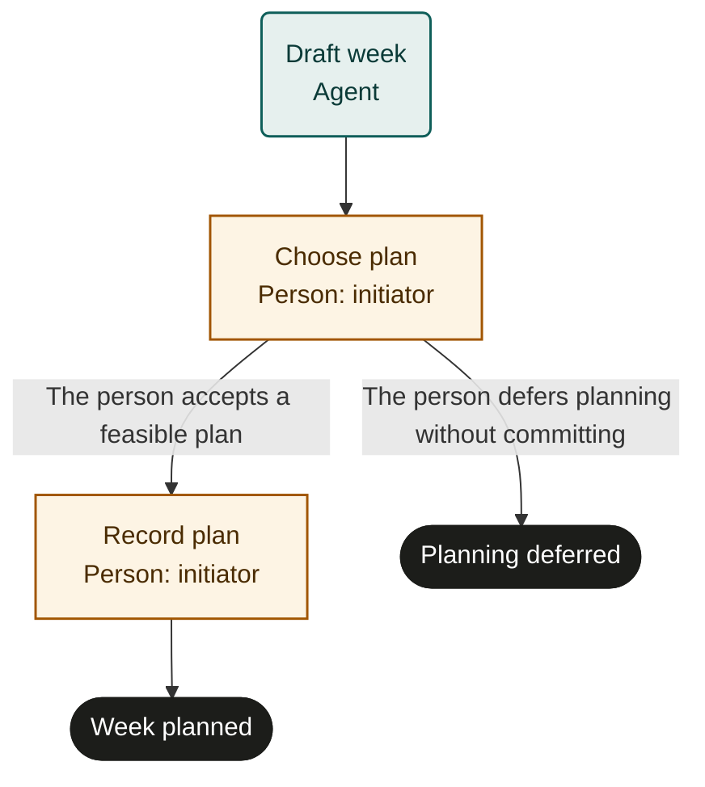

# Weekly planning

Marketplace fit: Individuals, freelancers and busy parents who want an achievable week rather than a longer task list.

## Purpose and scope
Start once for a selected week when commitments and priorities are available. Completion means a feasible plan is saved and checked; it does not mean the week's work is finished. The initiator owns and accepts the plan.

## Before adoption
- Start as a person because tasks use initiator; no other role bindings are needed.
- Choose a private planner and grant only the access you intend. Supply references to commitments and priorities.
- Define discretionary available hours, include care/rest commitments, and agree how estimates and buffers are handled.
- This is an adaptable template. Rehearse with sample data before any live calendar edits.

## Exceptions and recovery
Unavailable calendar information or unclear priorities goes back to the person through escalation. Inspect saved entries after an interrupted write; do not duplicate blocks. A changed commitment requires reviewing the affected plan, not erasing unrelated work. Deferral leaves the calendar unchanged.

## Measures and review
Track the share of planned outcomes completed or consciously renegotiated, and the time spent planning. Review actual capacity at the next weekly run; set personal targets only after observing a baseline.

## Rehearsal cases
- Capacity is ample: select the plan, save it, and verify entries.
- Commitments exceed capacity: defer work or choose planning_deferred.
- An interrupted calendar save already created entries: reuse them without duplication.

## Process map

Declared transitions below. Escalation, pending work and operator cancellation follow the instructions above.

